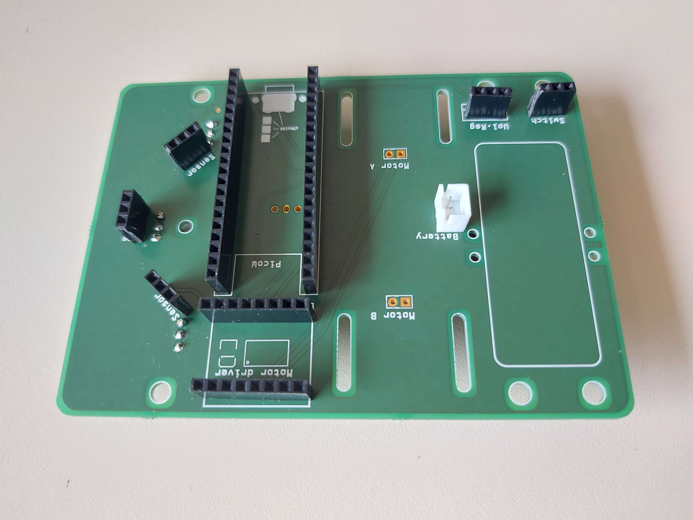

# Réflexion sur la création du PCB

## Objectifs
Nous sommes pas des éléctronicien, nous avons donc du apprendre à créer un PCB. Notre objectif est double apprendre à en réaliser un et de le faire en respectant les contraintes de notre projet.
// TODO - plus d'explication

## Contraintes
- Le PCB doit être le plus petit possible

## Photos

// TODO - Expliquer les images

## Difficultés
Après avoir réalisé le PCB, nous avons eu des difficultés à le faire fonctionner. Nous avons donc du faire des tests pour trouver les erreurs. Nous avons remarqué quelques erreurs de notre pars comme certains placement qui n'étais pas correcte. 
// TODO - plus d'explication