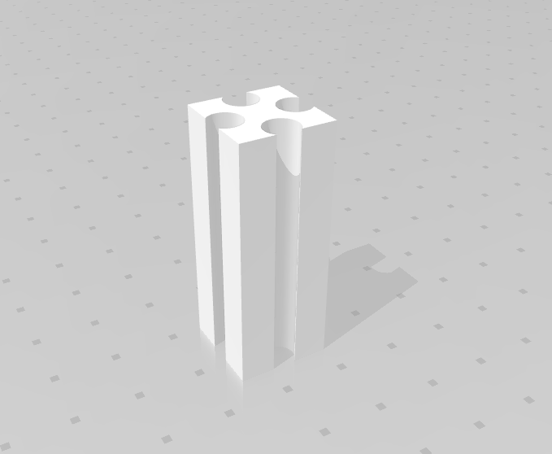

# Création du labyrinthe modulable

Lors de notre réflexion sur la construction de notre labyrinthe, nous voulions qu'il soit le plus modulable possible.
Ainsi, nous avons pensé la construction des pièces de notre labyrinthe comme un puzzle. Chaque pièce s'emboîte l'une par rapport à l'autre.
Nous avons donc des murs et des piliers. Afin de former des cases carrées de 20 cm de côté.

# Logiciel 
  - [FreeCAD](https://www.freecadweb.org/)
  - [Fusion 360](https://www.autodesk.com/products/fusion-360/overview)
  - [MakerBot](https://www.makerbot.com/)

# Matériel
  - Bobine PLA
  - Imprimante 3D
  - Pince coupante

# Développement des murs et des piliers

  

  

  Nous avions la nécessité de réaliser un labyrinthe dans lequel le robot devait pouvoir se déplacer. 
  De plus, ses capteurs devaient lui permettre de se repérer dans ce labyrinthe. 
  C'est pourquoi nous avons choisi de réaliser des cases de 20cm de largeur et de 5 cm de hauteur.
  Pour permettre au robot de connaître le centre d'une case, nous avons ajouté un quadrillage au sol.
  Les murs mesure 17 cm de longueur. Les coins mesurent 3 cm de largeur et 5 cm de hauteur. Ils permettent de relier jusqu'à quatre murs entre eux.

<!---

## Afficher en 3d le .glb

--->

