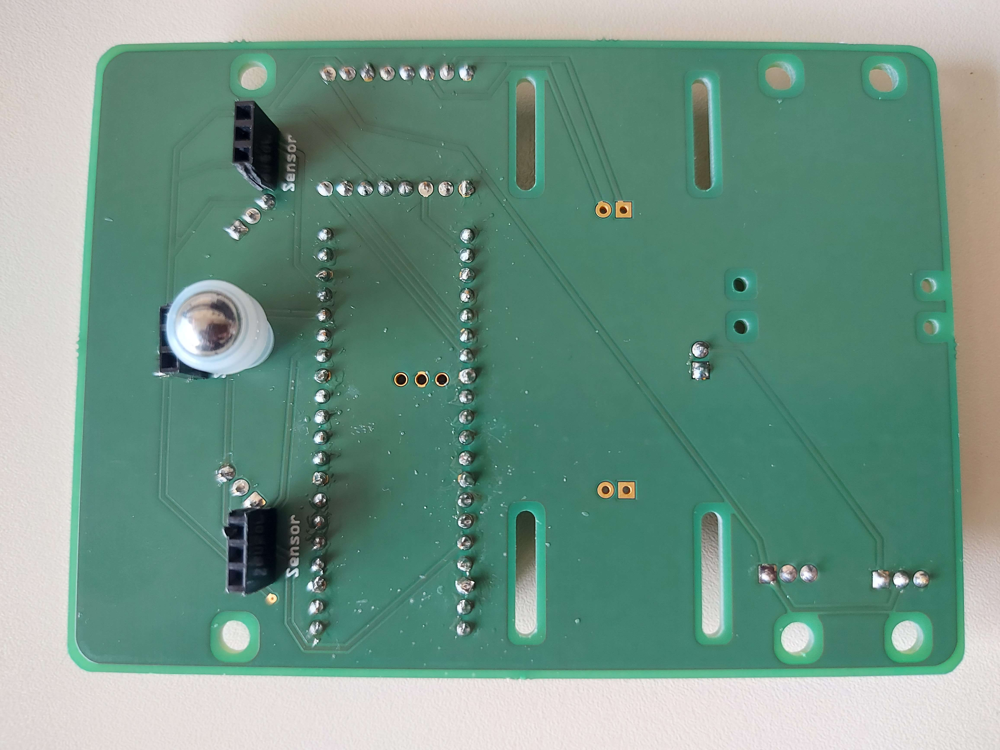
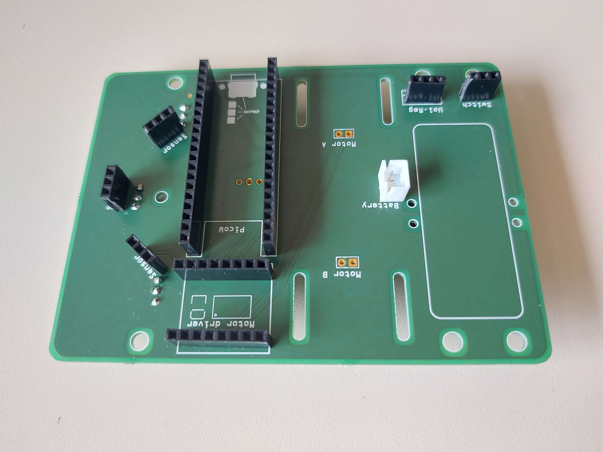

# Réflexion sur la création du PCB

## Objectifs

<!-- // TODO - plus d'explication -->

## Contraintes
Nous sommes pas des électroniciens, nous avons donc dû apprendre à créer un PCB. 
Nos objectifs sont : d'apprendre à en réaliser un et le faire en respectant les contraintes de notre projet.
- Le PCB doit être le plus petit possible

## Photos

<!-- // TODO - Expliquer les images -->

## Difficultés
Après avoir réalisé le PCB, nous avons eu des difficultés à le faire fonctionner. Nous avons donc dû faire des tests pour trouver les erreurs. Nous avons remarqué quelques erreurs de notre part comme certains placement qui n'était pas correct. 
<!-- // TODO - plus d'explication -->
